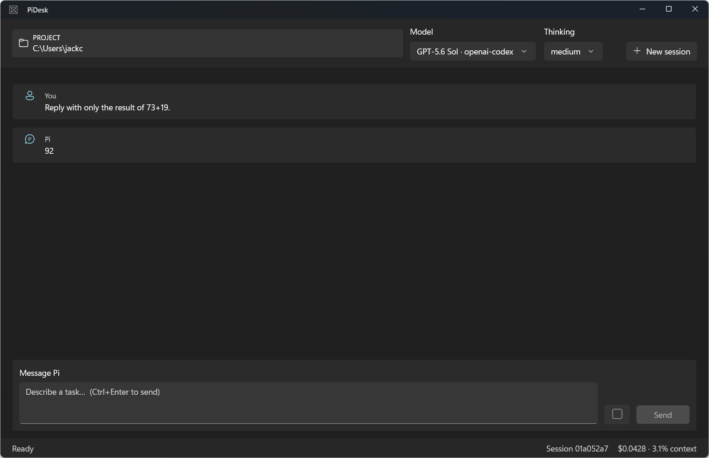

# PiDesk

PiDesk is a native WinUI 3 front end for the [Pi coding agent](https://pi.dev). It runs Pi's supported RPC mode as a child process, replacing terminal presentation while retaining Pi's models, credentials, sessions, tools, skills, extensions, and project instructions.



## Quick start

1. Install and authenticate Pi, and ensure `pi.cmd` is on `PATH`.
2. Install the [.NET 10 SDK](https://dotnet.microsoft.com/download) and [WinApp CLI 0.6+](https://github.com/microsoft/winappcli), and enable Windows Developer Mode.
3. In PowerShell 7, run `./BuildAndRun.ps1`.
4. Choose a project folder, select a model and thinking level, then describe the task.

The command remains attached while PiDesk is open, so shell elapsed time includes application runtime.

## Current capabilities

- Streaming assistant responses and basic tool activity
- Project-folder selection with cwd-bound persistent Pi sessions
- Model and thinking-level selection
- Steering messages while Pi is working
- Stop, new-session, cost, and context controls
- Pi extension dialogs for select, confirm, input, and editor requests
- Keyboard access, UI Automation identifiers, and system theme resources

PiDesk is currently a functional RPC client rather than a complete replacement for Pi's TUI. Session browsing, branching, rich tool output, diffs, Markdown, visible queues, responsive layouts, and release packaging are tracked in the improvement plan.

## Documentation

- [Architecture](docs/architecture.md)
- [Current design review](docs/design-review.md)
- [Improvement plan](docs/improvement-plan.md)
- [Development and testing](docs/development.md)

## Verification

Build with the bundled WinUI analyzer without launching:

```powershell
./BuildAndRun.ps1 . --no-launch --arch x64
```

Run the UI tests against a launched process:

```powershell
./ui-tests.ps1 -AppPid <PID>
```

The UI test sends one small model prompt and may incur a small provider charge. The latest recorded result is in [`docs/evidence/ui-test-results.json`](docs/evidence/ui-test-results.json).
